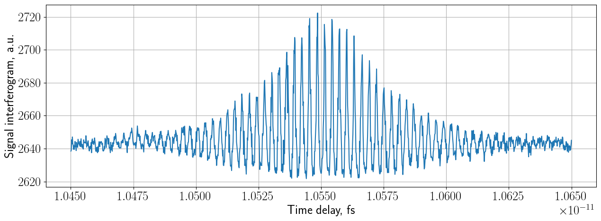
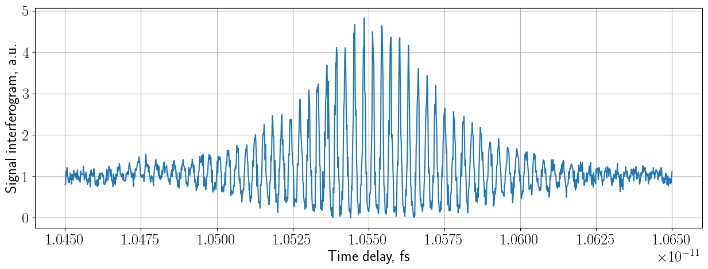
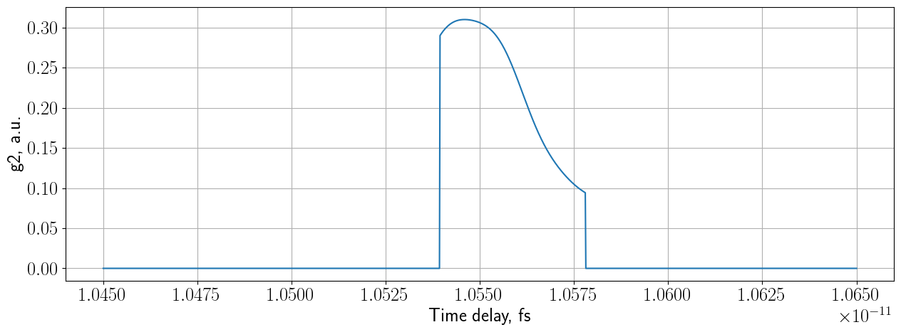
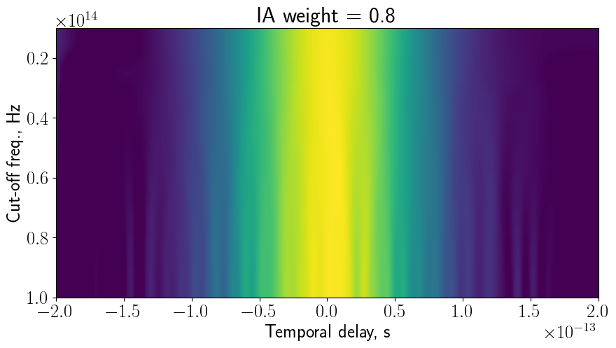

# A short user guide to python tools for visualization, analysis and modelling of interferometric data


Author: Pavel Kliuiev

Affiliation: Aalto University, Department of Applied Physics

```Interferometry``` is a Python-based framework that allows the user to visulaise, analyse and model interferometric data to extract the second-order degree of coherence from it.

## Documentation

The ```Interferometry``` framework contains several subpackages

* ```classes```: implementation of classes needed to work with experimental data and for its mathematical modelling 

    * ```Interferometry```class provides functionality for analysis of experimental interferometric data.
    * ```Simulation```class provides functionality  for mathematical modelling of interferometric data and its analysis.

* ```modules```: functions needed to work with the classes:

    - filtering.py
        - low_pass_filter
        - savitzky_golay_filter
    - fourier_transforms.py
        - ft_data
        - ift_data
    - g2_function.py
        - compute_g2
        - g2_vs_lowpass_cutoff
        - g2_vs_savitsky_golay
    - ica_tools.py
        - check_independence
    - minimization.py
        - interferogram_objective_function
        - find_best_mixture_of_interferograms
    - normalization.py
        - normalize_by_background
        - normalize_by_value_at_infinity
        - rescale_1_to_n
    - plots.py
        -  plot_1dsignal
        - plot_multiple_1dsignals
        - plot_subplots_1dsignals
        - plot_2dspectrogram
        - plot2dsubplots
        - plot_g2_analytical_filtered
    - sampling.py
        - get_time_step
        - get_time_units
        - zoom_in_2d
    - spectrograms.py
        - stft_spectrogram
        - wigner_ville_distribution
    - tpa_utils.py
        - closest_indicies
        - wigner_ville_distribution_tpa
        - loosely_thresholded_tpa_signal
        - tightly_thresholded_tpa_signal
        - tight_support_tpa
        - tight_support_tpa_simulation
    - utils.py
        - sort_list_of_tuples
        - get_wavelength_units
        - get_minmax_indices
        - random_noise

* ```tests```: unit tests
        
## Requirements

The software was tested using the following versions of the packages:

* ddt=1.4.1
* matplotlib=3.4.2
* numpy=1.21.2
* pandas=1.3.2
* parse=1.19.0
* pillow=8.3.1
* python=3.9.6
* scipy=1.7.1
* seaborn=0.11.2

## License

GNU General Public License v3.0

## Documentation
   
For a user guide see [online documentation](https://github.com/pkliui/Interferometry/blob/master/Interferometry/docs/InterferogramAnalysis.md)


```python
#import packages
import sys
import glob, os
from parse import parse

# set source path
codepath = os.path.abspath("/Users/Pavel/Documents/repos/Interferometry")
if codepath not in sys.path:
    sys.path.append(codepath)
    
    
gfx_path = "/Users/Pavel/Documents/project_folder/new-journal-physics/"

#automatically track changes in the source code
%load_ext autoreload
%autoreload 2
```

    The autoreload extension is already loaded. To reload it, use:
      %reload_ext autoreload


# Experimental interferograms


```python
from Interferometry.classes.interferogram import Interferogram
```

## Work with a specific dataset

## Read and display experimental data

* Initialize an instance of the class by providing all relevant arguments to ```ifgm = Interferogram()```

    * Provide the datapath to a directory of interest
    * Provide the filename to read
    * Set the units of time  and the time step used whilst recording the data
* The dataset is automatically read and saved in the ```ifgm.interferogram``` class variable.


```python
datapath = os.path.abspath("/Users/Pavel/Documents/repos/Interferometry/Interferometry/data/")
```


```python
datapath = os.path.abspath("/Users/Pavel/Documents/repos/Interferometry/Interferometry/data/")
filename = "20211014scan008-10650fs-to-10450fs-step-0.15fs-power-65.0uw-1exp-intrange-6500ns-bias-45v-volt-1k.txt"
filename = "20211014scan012-10650fs-to-10450fs-step-0.15fs-power-65.0uw-1exp-intrange-13000ns-bias-45v-volt-1k.txt"
ifgm = Interferogram(pathtodata = datapath, 
                     filetoread = filename, 
                     tau_units = "fs", 
                     tau_step = 0.15)
```

* Display the read dataset by calling the ```display_temporal_and_ft()```module on the class instance.

    * Specify all relevant arguments such as the wavelength range to display and the units. 
    * By setting ```vs_wavelength = True ```  one sets the Fourier data to be displayed as a function of wavelength instead of frequency
    * To plot only temporal data, set ```plot_type = temporal```
    * For details call  ```help(ifgm.display_temporal_and_ft)```


```python
ifgm.display_temporal_and_ft(vs_wavelength=True, 
                             plot_type="both", 
                             wav_min=400, 
                             wav_max=1000, 
                             wav_units="nm")
```

    Displaying the full range of arguments in Fourier domain


    

    


```python
ifgm.display_temporal_and_ft(vs_wavelength=False, 
                             plot_type="fourier")
```


    

    


    <Figure size 640x480 with 0 Axes>


```python
ifgm.display_temporal_and_ft(vs_wavelength=True, 
                             plot_type="fourier", 
                             wav_min=400, 
                             wav_max=1000, 
                             wav_units="nm")
```


    

    


    <Figure size 640x480 with 0 Axes>


```python
ifgm.display_temporal_and_ft(plot_type="temporal")
```


    

    


    <Figure size 640x480 with 0 Axes>


* If needed, the data can be padded with zero-valued pixels from both sides by ```zero_pad_interferogram``` method of the ```Interferogram``` class.

## Normalization


* Prior to processing and analysis the data must be normalised.

* The interferograms are typically normalised by the mean value of the signal distribution recorded in one arm of the interferometer. 

* For interferometric autocorrelation, the baseline-to-top ratio is  1:8  [Steinmeyer_1999, ULP_Keller]. 


* Currently implemented normalization routines:
    - ```normalize_interferogram_by_infinity``` (divides the interferogram by its value at a delay far away from the time zero, e.g. quasi at infinity)
    - ```rescale_interferogram``` (rescales the interferogram so that it has the value of 1 at the base-line level and the minimal value of 0)


```python
ifgm.normalize_interferogram_by_infinity(normalizing_width=10e-15, t_norm_start=10450e-15)
```


```python
ifgm.display_temporal_and_ft(vs_wavelength=False,
                             plot_type="temporal",
                             wav_min=400,
                             wav_max=1000,
                             wav_units="nm")
```


    

    


    <Figure size 640x480 with 0 Axes>


* Since the execution of the ```normalize_interferogram_by_infinity``` module re-writes the class variable with the interferogram, re-initialise the class before using the ```rescale_interferogram``` method


```python
ifgm = Interferogram(pathtodata = datapath, 
                     filetoread = filename, 
                     tau_units = "fs", 
                     tau_step = 0.15)

ifgm.rescale_interferogram(normalizing_width=10e-15, t_norm_start=10450e-15)
```


```python
ifgm.display_temporal_and_ft(vs_wavelength=False,
                             plot_type="temporal",
                             wav_min=400,
                             wav_max=1000,
                             wav_units="nm")
```


    

    


    <Figure size 640x480 with 0 Axes>


* NOTE: the if the interferogram acquisiton range is too narrow (e.g. ~4x FWHM of the pulse), then the use of ```rescale_interferogram``` method may be erronous. It is recommended to separately acquire the background (by blocking one arm of the interferometer) or to extend the acquisition range e.g. so that it is ~6x...8x of the FWHM of the pulse and then use the ```rescale_interferogram``` method .

## Time-frequency analysis

The ```display_temporal_and_ft```method computes the Fourier transform of the whole signal. To gain an insight into the local spectral characteristics of the signal as it changes over time, one could use the following methods:

* Short time Fourier transform (STFT)
* Wigner-Ville distribution (WVD)

Local spectral characteristics are important, or example, to analyse  the contributions of different harmonics as the signal changes over time. 


### Short time Fourier transform (STFT) spectrogram

* To compute the STFT spectrogram, call ```compute_stft_spectrogram```method on the intererogram's class instance.
* ```nperseg```sets the window size of the short time Fourier transform
* NOTE: the interferogram data must be normalized to have roughly 1:8 ratio!


```python
ifgm.compute_stft_spectrogram(nperseg=2**8, plotting=True, zoom_in_freq=2e15)
```


    

    


* The spectrogram contains the 0th, 1st and 2nd harmonic components. Due to the time-frequency uncertainty relation (we use a finite window to compute the FT), the temporal width of the harmonic peaks is only a rough estimate of the physical duration of the signals.
* STFT can be useful to gain a quick insight into the time-frequency representaion of the data

### Wigner-Ville distribution (WVD)

* WVD allows to obtain a better temporal resolution than STFT. See for example [Cohen_1999](http://people.ee.duke.edu/~lcarin/cohen.pdf)
* Call ```compute_wigner_ville_distribution```method on the intererogram's class instance and specify the parameters. One may need to vary the max and min hue values to achive a better contrast.


```python
ifgm.compute_wigner_ville_distribution(zoom_in_freq=0.75e15, plotting=True, vmin=-10, vmax=10);
```


    

    


* Just as the STFT, the WVD contains the 0th, 1st and 2nd harmonic components (well pronounced red  features in the figure above).  The red-blue zebra-like features located between the harmonics are WVD's interference artefacts. 

#### Application example: Estimation of the g2 support through the simulated FWHM-based TPA threshold


* The WVD could be used to estimate the temporal extent of the second harmonic component of the experimental data (the g2 function support) and hence the region where computing the second order degree of coherence makes sense.  


* Suggested procedure: 
* The TPA signal is extracted from the Wigner-Ville distribution of the measured interferogram. Given the signal, one needs to decide at what value of the intensity the signal to noise ratio is too low to make any sense to claim the TPA process had happened.  
* To estimate this value, we could, for example, do a simulation. We set the laser pulse duration to a certain value and then extract the intensity value of the TPA signal distribution  from the WVD of the simulation at the set FWHM pulse width.  For pulse duration in the range of interest (50-200 fs), the threshold is roughly the same and amounts to 20% of the maximum value of the TPA signal (see the seciton on Simulation below). 
* This number provides us with a reasonable estimate for the upper-limit of the TPA process and hence for the the g2 function support. 

* The steps would be:
    - make a simulation of the interferometric data in the Simulation class
    - call the ```g2_support_simulated```method of the Simulation class 
    - note a value returned by the ```g2_support_simulated``` method
    - set it to the ```tpa_thresh``` argument of the ```get_g2_support```method of the Interferogram class
    


* Call the ```get_g2_support```method on the Interferogram class instance and specify the parameters. 

* Setting too low ```tpa_tolerance```may lead to unrealistically narrow support. Too high values will lead to an overestimate. Values on the order of the optical cycle seem to be working well. See more info in the docstring of the corresponding method.


```python
tpa_freq = 3e8 / 440e-9
ifgm.get_g2_support(tpa_freq=tpa_freq, freq_window_size=3, tpa_thresh=0.2,
                               tpa_tolerance= 1/tpa_freq, vmin=-550, vmax=550, plotting=True);
```


    

    


## Computation of the second-order coherence function from experimental data

* The second order coherence function can be extracted by low-pass fitering.

### g2 by low-pass filtering using fixed parameters

* To compute the g2 function by low-pass filtering (Butterworth filter [Butterworth_1930](https://www.changpuak.ch/electronics/downloads/On_the_Theory_of_Filter_Amplifiers.pdf) ), use the ```compute_g2``` method of the Interferogram class.
* Specify the cut-off frequency and the filter order
* Setting ```apply_support=True``` will`make all the values outside of the support equal to 0.


```python
g2 = ifgm.compute_g2(filter_cutoff=5e13, filter_order=5, apply_support=False, plotting=True)
```


    

    


    <Figure size 640x480 with 0 Axes>


##### * **NOTE: the choice of the parameters, such as the cut-off frequency and the filter order, may have an impact onto the amplitude value of the resulting g2 function. If the data does not consist of the solely interferometric autocorrelation component, the value of the obtained g2 function will be lower than expected!** 


#### Example: g2 by low-pass filtering - varying cuttoff frequency and the filter order

* Using the ```compute_g2``` method of the Interferogram class implies that the best filter's parameters are known. 

* In this example, I plot the distribution of the g2 function vs. different cut-off frequencies and the filter orders. For that, I use the ```gen_g2_vs_cutoff```method.


```python
from Interferometry.modules import plots
from matplotlib import pyplot as plt
from mpl_toolkits.axes_grid1 import make_axes_locatable


# plot for different filter orders
filter_orders = [3, 4, 5]

def main(save_figure=True, pathtosave=None, save_name=None, params=None):

    fig, axes = plt.subplots(len(params), 1, sharex=True, sharey=True, figsize=(10,10))

    for ax, param in zip(axes, params):
        
        _,_,im = ifgm.gen_g2_vs_cutoff(cutoff_min = 1e12, cutoff_max = 5.5e14, cutoff_step = 1e13,
                              filter_order=param,
                              g2_min = 0, g2_max = 1,
                              cbar_min=0, cbar_max=1,
                              plotting = True, ax_num = ax, title="Filter order "+ str(param));

        divider = make_axes_locatable(ax)
        cax = divider.append_axes('right', size='5%', pad=0.05)
        fig.colorbar(im, cax=cax, orientation='vertical')
        fig.tight_layout()
        
    if save_figure:
        if os.path.exists(pathtosave):
            fig.savefig(pathtosave + "/" + save_name + ".eps")
        else:
            raise ValueError("The path to save the figure does not exist")


main(pathtosave=gfx_path, save_name="exp-butterworth-g2-vs-filter-order", params=filter_orders)
```


    

    


* For coherent light, at zero time delay the g2 function is expected to be 1.

* There could be a number of reasons if it is not the case, no matter what filter parameters are selected. Possible factors include wrong normalisation procedures and hence the wrong scaling of the data, wrong selection of the filter parameters, for example.

* For illustration purposes, those g2 function distributions, whose values at time delay zero are slightly above or below 1, are excluded from plotting. This is done by setting ```g2_mi``` and ```g2_max``` arguments.

* Set ``` apply_support ``` parameter to True in the ```compute_g2``` method to set the g2 function values to 0 at delays outside of the support. 


```python
g2=ifgm.compute_g2(filter_cutoff=5e13, filter_order=5, apply_support=True, plotting=True)
```


    

    


    <Figure size 640x480 with 0 Axes>


## Noise filtering
#### Example: Savitzky-Golay filtering of experimental data

* Zooming in to experimental interferograms, reveals the presence of noise.

* To de-noise, one could use e.g. Savitzky-Golay filter. The filter is optimal in the sense that it minimizes the least-squares error in fitting a polynomial to the samples of of noisy data. More info in [Savitzky_1964]


```python
ifgm = Interferogram(pathtodata = datapath, 
                     filetoread = filename, 
                     tau_units = "fs", 
                     tau_step = 0.15)

# interferogram before filtering
from matplotlib import pyplot as plt
plt.plot(ifgm.interferogram[600:-600])
plt.show()
```


    

    


* apply the filter by calling ```apply_savitzky_golay_filter```method on the class instance.

* set the filter's windows size either in pixels or relative to the Nyquist-Shannon's sampling rate (with 1 being the max possible window size as to not violate the sampling requirements)

* the filter order depends on the window size and hence has an upper bound

* **NOTE: application of the filter immediately re-writes the interferogram samples in the instance class (of course, they can be recovered back by initializing the class and reading out data)!**


```python
# filter (the numbers shall be chosen empirically - think about the physics and the sampling requirements)
ifgm.apply_savitzky_golay_filter(window_size_shannon=1, window_size_pxls=None,  order=1)
```


```python
# interferogram after filtering
from matplotlib import pyplot as plt
plt.plot(ifgm.interferogram[600:-600])
plt.show()
```


    

    


```python
ifgm.rescale_interferogram(normalizing_width=20e-15, t_norm_start=10450e-15)
ifgm.display_temporal_and_ft(vs_wavelength=False, 
                             plot_type="temporal", 
                             wav_min=400, 
                             wav_max=1000, 
                             wav_units="nm")
```


    

    


    <Figure size 640x480 with 0 Axes>


* Compute the g2 function again using the same method parameters, but this time using the filtered data.


```python
g2 = ifgm.compute_g2(filter_cutoff=5e13, filter_order=5, apply_support=False, plotting=True)
```


    

    


    <Figure size 640x480 with 0 Axes>


## Display all data in any directory for quick visualisation of temporal and FT distributions

You can also display all data in any directory of interest. It is assumed though that **all data were recorded using the same units of time** (all datasets have units of e.g. fs)

* Initialize an instance of the class by providing the relevant arguments to ```ifgm = Interferogram()```

    * Provide the datapath to a directory of interest
    * Set the unit of time used whilst recording the data
    * DO NOT set the ```filetoread``` and the ```time_step``` arguments - the code will find them out automatically whilst reading out the data sets.

* Display the datasets by calling the ```display_temporal_and_ft_batch()``` method on the instance of the initialized class.


```python
datapath = os.path.abspath("/Users/Pavel/Documents/repos/Interferometry/Interferometry/data/")

ifgm = Interferogram(pathtodata = datapath, tau_units = "fs")

ifgm.display_temporal_and_ft_batch(vs_wavelength=True, wav_min=300, wav_max=1000, wav_units="nm")
```

    Displaying the full range of arguments in Fourier domain


    

    


    Displaying the full range of arguments in Fourier domain


    

    


    Displaying the full range of arguments in Fourier domain


    

    


    Displaying the full range of arguments in Fourier domain


    

    


    Displaying the full range of arguments in Fourier domain


    

    


    Displaying the full range of arguments in Fourier domain


    

    


    Displaying the full range of arguments in Fourier domain


    

    


    Displaying the full range of arguments in Fourier domain


    

    


# Simulated interferograms 


* The following implements mathematical models of the interferometric as field autocorrelations as well as the mixtures of both.
* Implements different processing procedures to process the data, extract the value of the g2 function and hereby validate the suggested autocorrelation models. 

## Initialisation

### Interferometric autocorrelation


```python
from Interferometry.classes.simulation import Simulation
```


```python
sim = Simulation(lambd0=880e-9, t_fwhm0=50e-15, gvd=0e-30,  t_tpa0=None, t_phase=0, 
                 t_start=-200e-15, t_end=200e-15, delta_t=0.15e-15,
                 tau_start=-200e-15, tau_end=200e-15, tau_step=0.15e-15)
```

* The sampling rate  of the data is chosen according to the Nyquist-Shannon sampling rate, e.g. such that the sampling frequency $f_\textrm{sampling}$ is at least twice as high as the highest frequency of interest. As we aim at simulating the TPA process, the highest frequency of interest is set by $f_\textrm{max} = \frac{c}{\lambda/2}$, where $\lambda$ is the wavelength of light at one-photon absorption regime. For example, at $\lambda=880$ nm, the sampling step in time domain must be $1/f_\textrm{sampling} < $0.73 fs or smaller. 


* The interferometric autocorrelation can be generated by calling ```gen_interferogram``` method on the initialised class instance.

* By setting ```normalize=True```the data are automatically normalised by the mean value of the signal distribution recorded in one arm of the interferometer. 


```python
sim.gen_interferogram(temp_shift=0, plotting=True, add_noise=True, noise_percentage=0.2, normalize=True,
                      save_figure=True, pathtosave = gfx_path, save_name="ia-interferogram.png")
```


    

    


    

    


* The ratio between the bottom part of the normalised interferometric autocorrelation to its whole height is 1:8 as expected [Steinmeyer_1999], [ULP_Keller].

### Sum of interferometric and field autocorrelations, fixed parameters

* One could add a non-interferometric component (field autocorrelation) to the fully interferometric trace or simulate a solely field autocorrelation component.
* This can be done by setting the corresponding weights in the ```gen_complex_interferogram``` method.


```python
from matplotlib import pyplot as plt

sim = Simulation(lambd0=880e-9, t_fwhm0=50e-15, gvd=0e-30,  t_tpa0=None, t_phase=0, 
                 t_start=-200e-15, t_end=200e-15, delta_t=0.15e-15,
                 tau_start=-200e-15, tau_end=200e-15, tau_step=0.15e-15)

sim.gen_complex_interferogram(field_ac_weight=0.5, 
                              interferometric_ac_weight=0.5, temp_shift=0, 
                              normalize=True,
                              add_noise=True, noise_percentage=0.5, plotting=True,
                             save_figure=True, pathtosave = gfx_path, save_name="fa-interferogram");
```


    

    


#### Example: Interferometric-to-field autocorrelation ratio dependence

* The presence of the field autocorrelation changes the bottom-to-the-whole-height ratio and the shape of the signal making it more symmetric as the share of the IA decreases.


```python
import numpy as np

# initialize
sim = Simulation(lambd0=880e-9, t_fwhm0=50e-15, gvd=0e-30,  t_tpa0=None, t_phase=0, 
                 t_start=-200e-15, t_end=200e-15, delta_t=0.15e-15,
                 tau_start=-200e-15, tau_end=200e-15, tau_step=0.15e-15)
#
# set the range of field autocorrelation weights (in %) to go through
ii_start = 0 # start value
ii_step = 20 # step
ii_len = 100 # last value
noise_percentage=0.2
pathtosave = gfx_path


fig = plt.figure(figsize=[25,10])   
kk=0
for ii in range(ii_start, ii_len+ii_step, ii_step):
    ii = ii / ii_len
    sim.gen_complex_interferogram(field_ac_weight=ii, 
                                  interferometric_ac_weight=1-ii, temp_shift=0, 
                                  normalize=True,
                                  add_noise=True, noise_percentage=noise_percentage, plotting=False,
                                 save_figure=False, pathtosave = pathtosave);

    plt.subplot(1,int(ii_len/ii_step)+1,kk+1)
    plt.plot(sim.tau_samples, sim.interferogram)
    plt.title(str(100-100*ii)+'\% IAC')
    plt.xlabel("Time delay, s")
    plt.grid()
    plt.tight_layout()
    kk+=1

fig.savefig(gfx_path + "/opa-to-tpa-change.PNG")
```


    

    


## Normalization


* Prior to  processing the data must be normalised.

* The interferometric data are typically normalised by the mean value of the signal distribution recorded in one arm of the interferometer. 

* In the Simulation class this is done by setting the corresponding argument to ```True```.

* Currently implemented **alternative** normalization routines that can be applied to experimental data too:
    - ```normalize_interferogram_by_infinity``` (divides the interferogram by its value at a delay far away from the time zero, e.g. quasi at infinity)
    - ```rescale_interferogram``` (rescales the interferogram so that it has the value of 1 at the base-line level and the minimal value of 0)

### By re-scaling


```python
sim = Simulation(lambd0=880e-9, t_fwhm0=50e-15, gvd=0e-30,  t_tpa0=None, t_phase=0, 
                 t_start=-200e-15, t_end=200e-15, delta_t=0.15e-15,
                 tau_start=-200e-15, tau_end=200e-15, tau_step=0.15e-15)

sim.gen_interferogram(temp_shift=0, plotting=False, add_noise=False, noise_percentage=0.2,
                      normalize=False, save_figure=False, pathtosave = gfx_path)

sim.display_temporal_and_ft(save_figure=False, pathtosave = gfx_path, save_name="tpa-ft")
```

    Displaying the full range of arguments in Fourier domain


    

    


```python
sim.rescale_interferogram(normalizing_width=100e-15, t_norm_start=-200e-15)
sim.display_temporal_and_ft(save_figure=False, pathtosave = gfx_path, save_name="tpa-ft")
```

    Displaying the full range of arguments in Fourier domain


    

    


* Current implementation of the ```rescale_interferogram``` works well for the noise-less data

### Division by the mean value at infinity


```python
sim = Simulation(lambd0=880e-9, t_fwhm0=50e-15, gvd=0e-30,  t_tpa0=None, t_phase=0, 
                 t_start=-200e-15, t_end=200e-15, delta_t=0.15e-15,
                 tau_start=-200e-15, tau_end=200e-15, tau_step=0.15e-15)

sim.gen_interferogram(temp_shift=0, plotting=False, add_noise=True, noise_percentage=0.2,
                      normalize=False, save_figure=False, pathtosave = gfx_path)

sim.display_temporal_and_ft(save_figure=False, pathtosave = gfx_path, save_name="tpa-ft")
```

    Displaying the full range of arguments in Fourier domain


    

    


```python
sim.normalize_interferogram_by_infinity(normalizing_width=100e-15, t_norm_start=-200e-15)
sim.display_temporal_and_ft(save_figure=False, pathtosave = gfx_path, save_name="tpa-ft")
```

    Displaying the full range of arguments in Fourier domain


    

    


## Time-frequency analysis

The ```display_temporal_and_ft```method computes the Fourier transform of the whole signal. To gain an insight into the local spectral characteristics of the signal as it changes over time, one could use the following methods:

* Short time Fourier transform (STFT)
* Wigner-Ville distribution (WVD)

Local spectral characteristics are important, or example, to analyse  the contributions of different harmonics as the signal changes over time. 


### STFT 
#### Example: Varying size of the FT window


```python
import numpy as np
import matplotlib.pyplot as plt
import matplotlib.colors as colors

from Interferometry.modules import plots

def main(save_figure=True, pathtosave=None, save_name=None, params=None):
    nrows =  len(params)
    fig, axes = plt.subplots(nrows, 1, sharex=True, sharey=True, figsize=(10,10))

    for row, ii in zip(axes, params):
        signal_stft, t_stft_samples, f_stft_samples = sim.compute_stft_spectrogram(nperseg=2**ii, plotting=False, zoom_in_freq=2e15,
                            save_figure=False, pathtosave=gfx_path, save_name="stft")
        plots.plot2dsubplots(row, t_stft_samples, f_stft_samples, signal_stft, 
                             label_x="Time delay, s", label_y="Frequency, Hz")

    fig.tight_layout()
    #plt.show()
    
    if save_figure:
        if os.path.exists(pathtosave):
            fig.savefig(pathtosave + "/" + save_name + ".PNG")
        else:
            raise ValueError("The path to save the figure does not exist")


    
main(pathtosave=gfx_path, save_name="stft-varying-window-sizes", params=[6,7,8])
```


    

    


### Wigner-Ville distribution analysis


```python
sim.compute_wigner_ville_distribution(plotting=True, vmin=-100, vmax=100,
                                     save_figure=True, pathtosave=gfx_path, save_name="wvd");
```


    

    


#### Application example: Estimation of the g2 support through the simulated FWHM-based TPA threshold

* The method ```g2_support_simulated``` called on the Simulation class instance, estimates the g2 function support by doing the following:

1. extracts the TPA signal from the Wigner-Ville distribution of the measured interferogram;
2. estimates the intensity value of the extarcted TPA signal distribution at:

a. the specified temporal width of the TPA if it is specified by user (upon the initialisation of the Simulation class) - this provides the exact support,

b. the FWHM of the laser pulse (at -25 and 25 fs as the pulse length was set to 50 fs) if the temporal extent of the TPA region is unknown  - this provides a lower bound for the support i.e. overly tight support estimate.


* For pulse duration in the range of interest (50-200 fs), the threshold is roughly the same and amounts to 20% of the maximum value of the TPA signal. 

* The values returned by the ```g2_support_simulated``` method can be used in the extimation of the g2 support  in the experimental data (at least  case 2b).


##### Case 2a (unknown TPA region):


```python
sim = Simulation(lambd0=880e-9, t_fwhm0=50e-15, gvd=0e-30,  t_tpa0=None, t_phase=0, 
                 t_start=-200e-15, t_end=200e-15, delta_t=0.15e-15,
                 tau_start=-200e-15, tau_end=200e-15, tau_step=0.15e-15)

sim.gen_interferogram(temp_shift=0, plotting=False, add_noise=True, noise_percentage=0.2,
                      normalize=False, save_figure=False, pathtosave = gfx_path)

sim.normalize_interferogram_by_infinity(normalizing_width=100e-15, t_norm_start=-200e-15)


sim.g2_support_simulated(tpa_freq=3e8 / 440e-9, freq_window_size = 3, vmin=-1, vmax=1,
                               plotting=True);
```


    

    


    Threshold value of the WVD at TPA frequency is  0.25782927213476425


###### Case 2b: known TPA region of 20 fs
* We set ```t_tpa0=20e-15```


```python
sim = Simulation(lambd0=880e-9, t_fwhm0=50e-15, gvd=0e-30,  t_tpa0=20e-15, t_phase=0, 
                 t_start=-200e-15, t_end=200e-15, delta_t=0.15e-15,
                 tau_start=-200e-15, tau_end=200e-15, tau_step=0.15e-15)

sim.gen_interferogram(temp_shift=0, plotting=False, add_noise=True, noise_percentage=0.2,
                      normalize=False, save_figure=False, pathtosave = gfx_path)

sim.normalize_interferogram_by_infinity(normalizing_width=100e-15, t_norm_start=-200e-15)


sim.g2_support_simulated(tpa_freq=3e8 / 440e-9, freq_window_size = 3, vmin=-1, vmax=1,
                               plotting=True);
```


    

    


    Threshold value of the WVD at TPA frequency is  0.2852043947553054


## Computation of the second-order coherence function  from simulated data

### Analytical computation


```python
g2 = sim.gen_g2_analytical(plotting=True)
```

    /Users/Pavel/Documents/repos/Interferometry/Interferometry/classes/simulation.py:517: ComplexWarning: Casting complex values to real discards the imaginary part
      plt.title("g2")


    

    


### By low-pass filtering 

* Compute  the g2 function by low-pass filtering the simulated interferogram. Provide a cutoff frequency and an order of the Butterworth filter to ```gen_g2``` method. The values can be obtained, for example, from the analysis below.


```python
g2 = sim.gen_g2(filter_cutoff=0.15e15, filter_order=5, apply_support=False, plotting=True);
```


    

    


#### Example: g2 function by the Butterworth filtering  - varying the cut-off frequency and the filter order

* In this example, we inspect an impact of the cut-off frequency and the filter order onto the value of the g2 function. 

* The g2 values below and above ```g2_min``` and ```g2_max``` are set to 0 for illustration purposes.

* The results provide an idea of a suitable range of parameters for the low-pass filtering of experimental data acquired at similar conditions. 


```python
from Interferometry.modules import plots
from matplotlib import pyplot as plt
from mpl_toolkits.axes_grid1 import make_axes_locatable


# plot for different filter orders
filter_orders = [3, 4, 5]

# initialise, generate normalised interferogram 
sim = Simulation(lambd0=880e-9, t_fwhm0=50e-15, gvd=0e-30,  t_tpa0=None, t_phase=0, 
                 t_start=-200e-15, t_end=200e-15, delta_t=0.15e-15,
                 tau_start=-200e-15, tau_end=200e-15, tau_step=0.15e-15)

sim.gen_interferogram(temp_shift=0, plotting=False, add_noise=True, noise_percentage=0.2,
                      normalize=True, save_figure=False, pathtosave = gfx_path)


def main(save_figure=True, pathtosave=None, save_name=None, params=None):

    fig, axes = plt.subplots(len(params), 1, sharex=True, sharey=True, figsize=(10,10))

    for ax, param in zip(axes, params):
        
        _,_,im = sim.gen_g2_vs_cutoff(cutoff_min = 1e13, cutoff_max = 2e14, cutoff_step = 1e13,
                              filter_order=param,
                              g2_min = 0.97, g2_max = 1.03,
                              cbar_min=0, cbar_max=1,
                              plotting = True, ax_num = ax, title="Filter order "+ str(param));

        divider = make_axes_locatable(ax)
        cax = divider.append_axes('right', size='5%', pad=0.05)
        fig.colorbar(im, cax=cax, orientation='vertical')
        fig.tight_layout()
        
    if save_figure:
        if os.path.exists(pathtosave):
            fig.savefig(pathtosave + "/" + save_name + ".eps")
        else:
            raise ValueError("The path to save the figure does not exist")


main(pathtosave=gfx_path, save_name="exp-undersampling-g2", params=filter_orders)
```


    

    


##### Example: g2 function by the Butterworth filtering - Pulse duration


```python
from Interferometry.modules import plots
from matplotlib import pyplot as plt
from mpl_toolkits.axes_grid1 import make_axes_locatable


# plot for different pulse durations
pulse_durations = [50e-15, 100e-15, 250e-15]

def main(save_figure=True, pathtosave=None, save_name=None, params=None):

    fig, axes = plt.subplots(len(params), 1, sharex=True, sharey=True, figsize=(10,10))

    for ax, param in zip(axes, params):
        
        sim = Simulation(lambd0=880e-9, t_fwhm0=param, gvd=0e-30,  t_tpa0=None, t_phase=0, 
                 t_start=-200e-15, t_end=200e-15, delta_t=0.15e-15,
                 tau_start=-200e-15, tau_end=200e-15, tau_step=0.15e-15)
        
        sim.gen_interferogram(temp_shift=0, plotting=False, add_noise=True, noise_percentage=0.2,
                      normalize=True, save_figure=False, pathtosave = gfx_path)
        
        _,_,im = sim.gen_g2_vs_cutoff(cutoff_min = 1e13, cutoff_max = 2e14, cutoff_step = 1e13,
                              filter_order=5,
                              g2_min = 0.98, g2_max = 1.02,
                              cbar_min=0, cbar_max=1,
                              plotting = True, ax_num = ax, title="Pulse duration "+ str(param*1e15) + " fs");

        divider = make_axes_locatable(ax)
        cax = divider.append_axes('right', size='5%', pad=0.05)
        fig.colorbar(im, cax=cax, orientation='vertical')
        fig.tight_layout()
        
    if save_figure:
        if os.path.exists(pathtosave):
            fig.savefig(pathtosave + "/" + save_name + ".eps")
        else:
            raise ValueError("The path to save the figure does not exist")


main(pathtosave=gfx_path, save_name="butterworth-g2-vs-pulse-duration", params=pulse_durations)
```


    

    


#### Example: comparison of the reconstructed vs analytically simulated g2 function


```python
from Interferometry.modules import plots
sim = Simulation(lambd0=880e-9, t_fwhm0=100e-15, gvd=0e-30,  t_tpa0=None, t_phase=0, 
                 t_start=-200e-15, t_end=200e-15, delta_t=0.15e-15,
                 tau_start=-200e-15, tau_end=200e-15, tau_step=0.15e-15)

sim.gen_interferogram(temp_shift=0, plotting=False, add_noise=True, noise_percentage=0.2,
                      normalize=True, save_figure=False, pathtosave = gfx_path)

g2_analytical = sim.gen_g2_analytical(plotting=False);
g2_filtered = sim.gen_g2(filter_cutoff=0.5e14, filter_order=5, apply_support=False, plotting=False);

plots.plot_multiple_1dsignals(sim.tau_samples, "Temporal delay, s", "g2 value, a.u.", 
                              (g2_analytical, "analytical"), (g2_filtered, "reconstructed"),
                             save_figure=True, pathtosave=gfx_path, save_name="g2-analytical-reconstructed")
```

    /Users/Pavel/Documents/repos/Interferometry/Interferometry/classes/simulation.py:517: ComplexWarning: Casting complex values to real discards the imaginary part
      plt.title("g2")


    

    


    The PostScript backend does not support transparency; partially transparent artists will be rendered opaque.
    The PostScript backend does not support transparency; partially transparent artists will be rendered opaque.


#### Example: g2 function of a mixture of interferometric and non-interferometric distributions


```python
sim.gen_complex_interferogram(field_ac_weight=0.5, interferometric_ac_weight=0.5, temp_shift=0, 
                              add_noise=True, noise_percentage=0.2, normalize=True, plotting=False)
sim.display_temporal_and_ft()
```

    Displaying the full range of arguments in Fourier domain


    

    


```python
sim.gen_g2(filter_cutoff=60e12, filter_order=3, apply_support=False,  plotting=True);
```


    

    


##### Example: g2 for a range of interferometric-field-autocorrelation ratios

* In the previous example, the value of the g2 function at the zero delay is reduced to rouhgly 0.5 = the share of the interferometric data in the signal.

* In this example,  vary the interferometric weight share and plot the g2 function for a range of cut-off frequencies
* Keep g2 values ±5% of the interferometric weight value only.
* Colorbar: 0...interferometric weight


```python
from Interferometry.modules import plots
from matplotlib import pyplot as plt
from mpl_toolkits.axes_grid1 import make_axes_locatable


for if_ac_weight in range(1, 10, 1):
    if_ac_weight = 0.1 * if_ac_weight
    
    sim.gen_complex_interferogram(field_ac_weight=1-if_ac_weight, 
                                  interferometric_ac_weight=if_ac_weight, temp_shift=0, 
                              add_noise=True, noise_percentage=0.2, normalize=True, plotting=False)
    
    g2_min = 0.95 * if_ac_weight
    g2_max = 1.05 * if_ac_weight
        
    _,_,im = sim.gen_g2_vs_cutoff(cutoff_min = 1e13, cutoff_max = 1e14, cutoff_step = 1e13,
                              filter_order = 5,
                              g2_min = g2_min, g2_max = g2_max,
                     cbar_min = 0, cbar_max = if_ac_weight,
                              plotting = True, title = "IA weight = " + str(if_ac_weight));
    
```


    

    


    

    


    

    


    

    


    

    


    

    


    

    


    

    


    

    


```python
from Interferometry.modules import plots
from matplotlib import pyplot as plt
from matplotlib import colors
from mpl_toolkits.axes_grid1 import make_axes_locatable
from matplotlib import cm
import numpy as np

g2_average_list = []

def main(save_figure=True, pathtosave=None, save_name=None, NUM_WEIGHTS=10):

    color = cm.magma(np.linspace(0, 1, NUM_WEIGHTS+1))
    fig, axes = plt.subplots(1, 1, sharex=True, sharey=True, figsize=(7,4))


    for if_ac_weight, col in zip(range(1, NUM_WEIGHTS+1, 1), color):

        if_ac_weight = (1/NUM_WEIGHTS) * if_ac_weight

        sim.gen_complex_interferogram(field_ac_weight=1-if_ac_weight, 
                                  interferometric_ac_weight=if_ac_weight, temp_shift=0, 
                              add_noise=True, noise_percentage=0.2, normalize=True, plotting=False)

        g2_min = 0.95 * if_ac_weight
        g2_max = 1.05 * if_ac_weight

        _, g2_average, _ = sim.gen_g2_vs_cutoff(cutoff_min = 0.1e14, cutoff_max = 0.7e14, cutoff_step = 1e13,
                                  filter_order = 3,
                                  g2_min = g2_min, g2_max = g2_max,
                                  plotting = False);
        g2_average_list.append(g2_average)

        plt.plot(sim.tau_samples, g2_average, c=col)
        plt.plot(0, len(g2_average)/2, if_ac_weight, "X", c=col)
    #plt.plot(sim.tau_samples, g2_average, c=col, label='reconstructed')
    #plt.plot(0, len(g2_average)/2, "X", c=col, label='IA weight')
    plt.legend(loc="upper left")
        
    
    plt.ylim((0,1.1))
    plt.xlabel("Delay, s")
    plt.ylabel("$g^{(2)}$, a.u.")
    plt.grid()
    plt.show()
    fig.tight_layout()
    
    if save_figure:
        if os.path.exists(pathtosave):
            fig.savefig(pathtosave + "/" + save_name + ".eps")
        else:
            raise ValueError("The path to save the figure does not exist")

main(pathtosave=gfx_path, save_figure=False, save_name="g2-vs-field-ac-ratio", NUM_WEIGHTS=10)
```

    No handles with labels found to put in legend.


    

    


##### Example: g2 function from interferometric autocorrelation, noise dependence


```python
sim = Simulation(lambd0=880e-9, t_fwhm0=50e-15, t_phase=0, 
                 t_start=-100e-15, t_end=100e-15, delta_t=0.15e-15,
                 tau_start=-100e-15, tau_end=100e-15, tau_step=0.15e-15)
```


```python
from Interferometry.modules import plots
from matplotlib import pyplot as plt
from mpl_toolkits.axes_grid1 import make_axes_locatable


# plot for different filter orders
noise_levels = [0.0, 0.2, 0.4, 0.6, 0.8]

def main(save_figure=True, pathtosave=None, save_name=None, params=None):

    fig, axes = plt.subplots(len(params), 1, sharex=True, sharey=True, figsize=(10,15))

    for ax, param in zip(axes, params):
        
        sim.gen_complex_interferogram(field_ac_weight=0,
                                      interferometric_ac_weight=1, 
                                      temp_shift=0, 
                                      plotting=False,
                                      add_noise=True, noise_percentage=param)
        
        _,_,im = sim.gen_g2_vs_cutoff(cutoff_min = 1e12, cutoff_max = 4e14, cutoff_step = 1e13,
                              filter_order=3,
                              g2_min = 0.95, g2_max = 1.05,
                              cbar_min=0, cbar_max=1,
                              plotting = True, ax_num = ax, title="SNR =  "+ str(1-param));

        divider = make_axes_locatable(ax)
        cax = divider.append_axes('right', size='5%', pad=0.05)
        fig.colorbar(im, cax=cax, orientation='vertical')
        fig.tight_layout()
        
    if save_figure:
        if os.path.exists(pathtosave):
            fig.savefig(pathtosave + "/" + save_name + ".eps")
        else:
            raise ValueError("The path to save the figure does not exist")


main(pathtosave=gfx_path, save_name="g2-vs-snr", params=noise_levels)
```


    

    


```python
from Interferometry.modules import plots
from matplotlib import pyplot as plt
from matplotlib import colors
from mpl_toolkits.axes_grid1 import make_axes_locatable
import matplotlib.cm as cm
import numpy as np

g2_average_list = []

# plot for different filter orders
noise_levels = list(np.linspace(0,0.5,5))


def main(save_figure=True, pathtosave=None, save_name=None, params=None):

    color = cm.magma(np.linspace(0, 1, len(params)+1))
    fig, axes = plt.subplots(1, 1, sharex=True, sharey=True, figsize=(15,4))


    for param, col in zip(params, color):

        sim.gen_complex_interferogram(field_ac_weight=0, 
                                  interferometric_ac_weight=1, temp_shift=0, 
                                  normalize=True,
                                  add_noise=True, noise_percentage=param, plotting=False,
                                 save_figure=False, pathtosave = gfx_path)

        g2_min = 0.95
        g2_max = 1.05

        _, g2_average, _ = sim.gen_g2_vs_cutoff(cutoff_min = 0.5e14, cutoff_max = 1e14, cutoff_step = 1e13,
                                  filter_order = 5,
                                  g2_min = g2_min, g2_max = g2_max,
                                  plotting = False);
        g2_average_list.append(g2_average)

        plt.plot(sim.tau_samples, g2_average, c=col, label="SNR "+str(1-param))

    plt.legend(loc="upper left")
        
    
    plt.ylim((0,1.1))
    plt.xlabel("Delay, s")
    plt.ylabel("$g^{(2)}$, a.u.")
    plt.grid()
    plt.show()
    fig.tight_layout()
    
    if save_figure:
        if os.path.exists(pathtosave):
            fig.savefig(pathtosave + "/" + save_name + ".eps")
        else:
            raise ValueError("The path to save the figure does not exist")

main(pathtosave=gfx_path, save_name="g2-vs-snr-average", params = noise_levels)
```


    

    


    The PostScript backend does not support transparency; partially transparent artists will be rendered opaque.
    The PostScript backend does not support transparency; partially transparent artists will be rendered opaque.


# Literature

[Butterworth_1930](https://www.changpuak.ch/electronics/downloads/On_the_Theory_of_Filter_Amplifiers.pdf) Butterworth. On the theory of filter amplifiers, 1930. 

[Cohen_1999](http://people.ee.duke.edu/~lcarin/cohen.pdf) Cohen. Time-frequency distributions. A review. Proc. IEEE 77, 7, 1989

[Savitzky_1964](https://doi.org/10.1021%2Fac60214a047)  Savitzky and Golay. "Smoothing and Differentiation of Data by Simplified Least Squares Procedures". Analytical Chemistry. 36 (8): 1627–39, 1964

[Steinmeyer_1999](http://www.jstor.org/stable/2899810) Steinmeyer et al. Science, New Series, Vol. 286, No. 5444 (Nov. 19, 1999)

[ULP_Keller](https://ulp.ethz.ch/education/lectures/ultrafast-laser-physics/lecture-notes.html) Keller and Gallmann. Ultrafast Laser Physics, ETHZ, lecture notes.


```python

```
